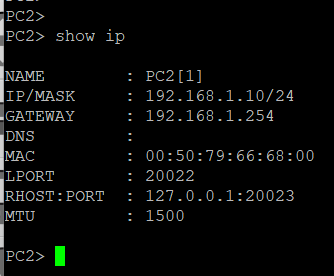
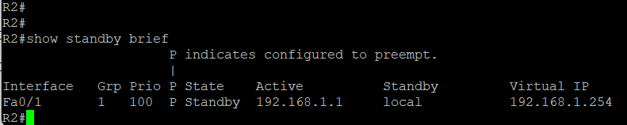
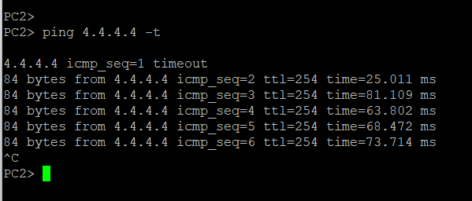
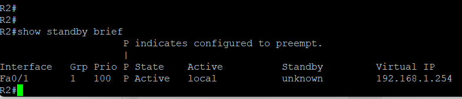
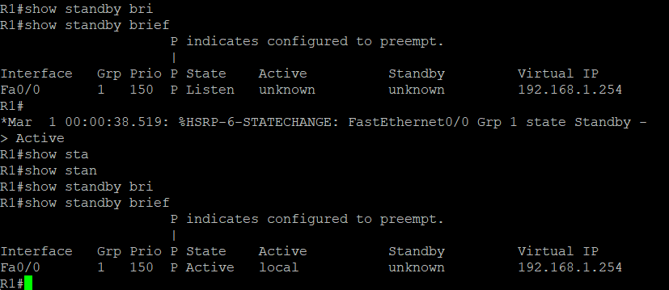

1.🎯 Objective

To master HSRP (Hot Standby Router Protocol) for providing default gateway redundancy in a local network. The goal is to ensure uninterrupted connectivity for client devices even if the primary router fails. Two routers (R1 and R2) share a virtual IP address that clients use as their default gateway.

2.🖧 Topology and Addressing

Three routers – R1, R2, and R3 – are used in the lab.

    ✅ R1 and R2 are connected to the client subnet 192.168.1.0/24 via FastEthernet0/0.

    ✅ R1 and R2 are connected to R3 (external network) via FastEthernet0/1.

    ✅ R3 has a loopback interface 4.4.4.4/32 representing an external server that clients will ping.

    ✅ A VPCS client is connected to the switch and is part of the 192.168.1.0/24 subnet.

📋 IP Addressing Table

Device | Interface | Ip Address | Subnet Mask
---------------------------------------------
R1     | Fa0/0     | 192.168.1.1| /24
---------------------------------------------
R1     | Fa0/1     | 10.0.13.1  | /24
---------------------------------------------
R2     | Fa0/0     | 192.168.1.2| /24
---------------------------------------------
R2     | Fa0/1     | 10.0.23.2  | /24
---------------------------------------------
R3     | Fa0/0     | 10.0.13.3  | /24
---------------------------------------------
R3     | Fa0/1     | 10.0.23.3  | /24
---------------------------------------------
R3     | Loopback0 | 4.4.4.4    | /32
---------------------------------------------
VPCS   | eth0      |192.168.1.10| /24
---------------------------------------------

🔑 HSRP Virtual Gateway:

    Virtual IP: 192.168.1.254

    🔵 R1 – Active (priority 150)

    🟡 R2 – Standby (priority 100)

3. ⚙️ Basic Interface Configuration

🖥️ On R1:
	configure terminal
	interface fastEthernet 0/0
 	ip address 192.168.1.1 255.255.255.0
 	no shutdown
 	exit
	!
	interface fastEthernet 0/1
 	ip address 10.0.13.1 255.255.255.0
 	no shutdown
 	exit
	!
	interface loopback 0
 	ip address 1.1.1.1 255.255.255.255
 	exit

🖥️ On R2:
	conf t
	int fa0/0
 	ip address 192.168.1.2 255.255.255.0
 	no shutdown
 	exit
	!
	interface fastEthernet 0/1
 	ip address 10.0.23.2 255.255.255.0
 	no shutdown
 	exit
	!
	interface loopback 0
 	ip address 2.2.2.2 255.255.255.255
 	exit

🖥️ On R3:
	conf t
	int fa0/0
 	ip address 10.0.13.3 255.255.255.0
 	no shutdown
 	exit
	!
	int fa0/1
 	ip address 10.0.23.3 255.255.255.0
 	no shutdown
 	exit
	!
	int loopback 0
 	ip address 4.4.4.4 255.255.255.255
 	exit

4. 🗺️ Routing Configuration (so clients can reach external networks)

🔵 On R1:
	router ospf 1
 	router-id 1.1.1.1
 	network 192.168.1.0 0.0.0.255 area 0
	network 10.0.13.0 0.0.0.255 area 0
	network 1.1.1.1 0.0.0.0 area 0

🟡 On R2:
	router ospf 1
 	router-id 2.2.2.2
 	network 192.168.1.0 0.0.0.255 area 0
 	network 10.0.23.0 0.0.0.255 area 0
 	network 2.2.2.2 0.0.0.0 area 0

🟢 On R3:
	router ospf 1
 	router-id 3.3.3.3
 	network 10.0.13.0 0.0.0.255 area 0
 	network 10.0.23.0 0.0.0.255 area 0
 	network 4.4.4.4 0.0.0.0 area 0
	

5. 🔐 HSRP Configuration

🔵 On R1 (Active – higher priority):
	int fa0/0
 	standby 1 ip 192.168.1.254
 	standby 1 priority 150
 	standby 1 preempt
 	standby 1 name HSRP-GROUP
 	exit

🟡 On R2 (Standby – lower priority):
	int fa0/0
 	standby 1 ip 192.168.1.254
 	standby 1 priority 100
 	standby 1 preempt
 	standby 1 name HSRP-GROUP
 	exit

6. 💻 Client Configuration

On the VPCS client, set:

	ip 192.168.1.10 255.255.255.0 192.168.1.254

⚠️ The client's default gateway is the virtual IP (192.168.1.254), not the physical IP of R1 or R2.

7. 🔍 Verification

Check HSRP state on R1:

	show standby brief
	

Check HSRP state on R2:

	show standby brief

8. ⚡ Test: Failover Demonstration

Step 1 – Normal operation:✅
From VPCS, run continuous ping to 4.4.4.4 (R3's loopback):

	ping 4.4.4.4 -t

✅ All pings succeed. Traffic goes through R1 (Active).

Step 2 – Simulate failure:🔴
On R1, shut down the interface connected to the client subnet:

Observe:

    ⏱️ On R2, HSRP detects R1 is no longer sending Hello packets (after ~3 seconds).

    🔄R2 transitions to Active state.

    📶 VPCS pings continue – only 1–2 packets may be lost (convergence time).

Step 3 – Restore R1:🔵
On R1, bring the interface back up:

Observe:

    🔄 Due to preempt, R1 takes back the Active role after a few seconds.

    ✅ Client traffic automatically switches back to R1 (no interruption).
		

9. 🏁 Conclusion

In this lab, using Cisco 3725 routers and a VPCS client in GNS3:

    ✅ HSRP was configured with R1 as Active (priority 150) and R2 as Standby (priority 100).

    ✅ The client used the virtual IP 192.168.1.254 as its default gateway.

    ✅ A failover test proved that the client's connectivity to an external server (4.4.4.4) was preserved even after the Active router's interface was shut down.

    ✅ Only 1–2 packets were lost during the failover, which is acceptable for most applications.

    ✅ HSRP preemption was demonstrated – R1 regained its Active role after recovery.

These skills are essential for building resilient, high-availability networks used in data centres, enterprise campuses, and service provider environments.