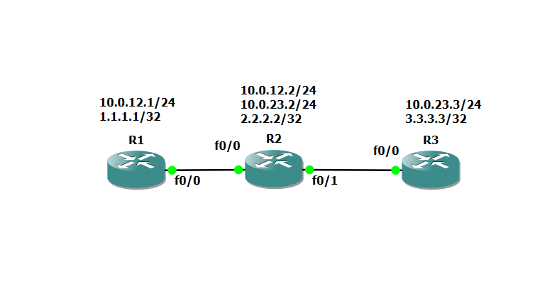
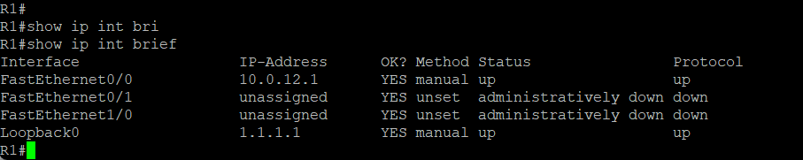
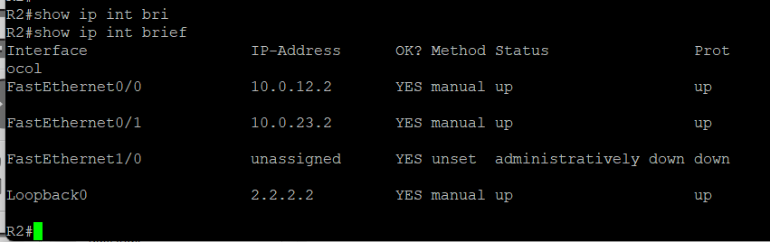
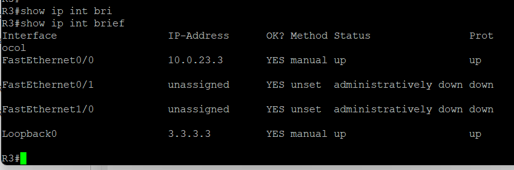
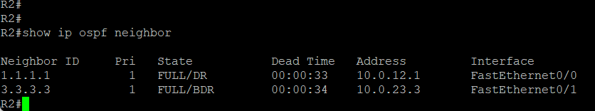
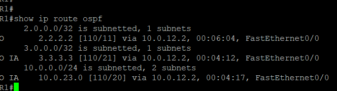
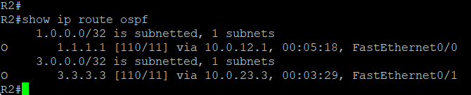
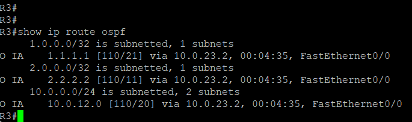
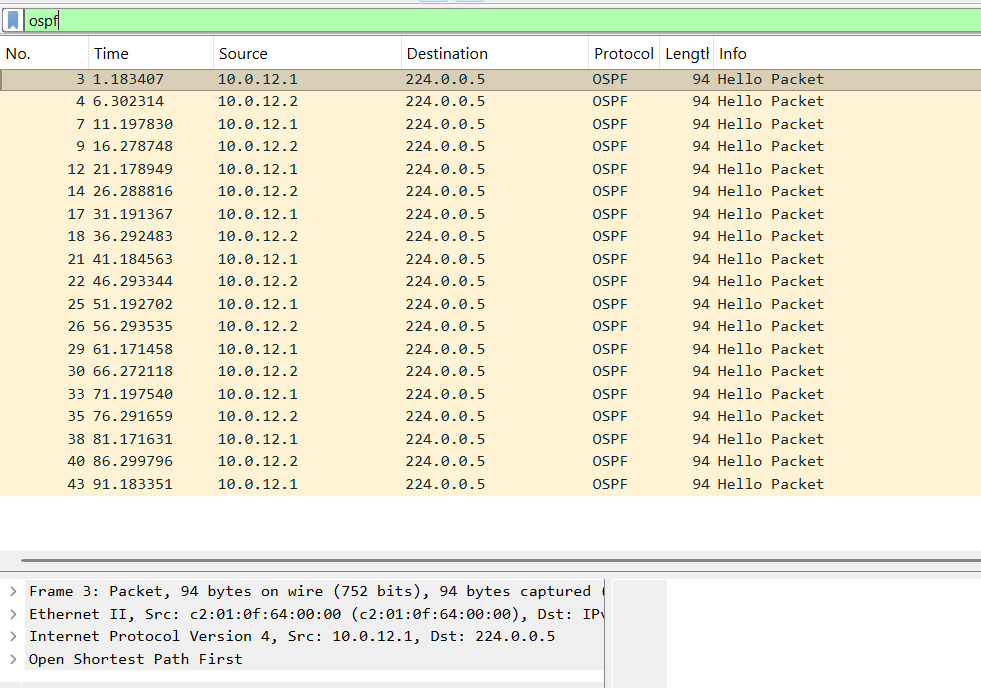

1. Objective

To master the OSPF (Open Shortest Path First) dynamic routing protocol in a multi‑area configuration. The goal is to learn how to design a hierarchical topology with a backbone area (Area 0) and a non‑backbone area, and to verify full reachability between all advertised networks.

2. Topology and Addressing

Three routers – R1, R2, and R3 – are connected in a chain inside GNS3.

    R1 – R2 link: FastEthernet0/0, subnet 10.0.12.0/24.

    R2 – R3 link: FastEthernet0/1, subnet 10.0.23.0/24.
    Each router has a loopback interface to simulate a local stub network:

    R1: Loopback0 – 1.1.1.1/32

    R2: Loopback0 – 2.2.2.2/32

    R3: Loopback0 – 3.3.3.3/32

OSPF area assignment:

    Area 0 (backbone): subnet 10.0.12.0/24 (R1–R2 link) plus loopbacks of R1 and R2.

    Area 1: subnet 10.0.23.0/24 (R2–R3 link) plus loopback of R3.
    R2 acts as an ABR (Area Border Router) because it connects Area 0 and Area 1.

3. Basic Interface Configuration

On R1:
	conf t
	int fa0/0
 	ip address 10.0.12.1 255.255.255.0
 	no shutdown
 	exit
	!
	interface loopback 0
 	ip address 1.1.1.1 255.255.255.255
 	exit
On R2:
	conf t
	int fa0/0
 	ip address 10.0.12.2 255.255.255.0
 	no shutdown
 	exit
	!
	int fa0/1
 	ip address 10.0.23.2 255.255.255.0
 	no shutdown
 	exit
	!
	int loopback 0
 	ip address 2.2.2.2 255.255.255.255
 	exit
On R3:
	conf t
	int fa0/0
 	ip address 10.0.23.3 255.255.255.0
 	no shutdown
 	exit
	!
	int loopback 0
 	ip address 3.3.3.3 255.255.255.255
 	exit

4. OSPF Configuration

On R1 (Area 0):
	router ospf 1
 	router-id 1.1.1.1
 	network 10.0.12.0 0.0.0.255 area 0
 	network 1.1.1.1 0.0.0.0 area 0

On R2(Area 0 and Area 1)
	router ospf 1
 	router-id 2.2.2.2
 	network 10.0.12.0 0.0.0.255 area 0
 	network 10.0.23.0 0.0.0.255 area 1
 	network 2.2.2.2 0.0.0.0 area 0

On R3 (Area 1):
	router ospf 1
 	router-id 3.3.3.3
 	network 10.0.23.0 0.0.0.255 area 1
 	network 3.3.3.3 0.0.0.0 area 1

5. Verification of Neighbours and Routing Tables
After applying the configurations, check:

OSPF neighbours:

	show ip ospf neighbor

Each router should display neighbours in FULL/DR or FULL/BDR state.

Routing tables:
	
	show ip route ospf

R1 should see routes to 2.2.2.2/32 and 3.3.3.3/32.

R3 should see 1.1.1.1/32 and 2.2.2.2/32.

R2 knows all three loopbacks – one directly connected, two via OSPF.

6. Analysis of OSPF Behaviour and Route Selection

    OSPF uses the Dijkstra (SPF) algorithm to compute the shortest path based on interface cost. Default cost = 10⁸ / bandwidth (bps). For FastEthernet (100 Mbps), cost = 1.

    In our topology all links have the same cost (1). The cost to a loopback network equals the sum of link costs along the path.

    On R1, route to 3.3.3.3: path via R2, cost = 1+1 = 2. No alternative exists.

    On R3, route to 1.1.1.1: similarly, cost = 2.

    On R2, all loopbacks have cost 1 (directly connected loopback, plus one link to each other loopback).

LSA types involved:

    Type 1 (Router LSA) – generated by every router for its own area.

    Type 3 (Summary LSA) – generated by the ABR (R2) to advertise routes between areas.

Thanks to Type 3 LSAs, routes from Area 1 appear in R1’s routing table, and vice versa.

7. Capturing OSPF Packets with Wireshark

To demonstrate the neighbour establishment process, a packet capture was performed on R2’s FastEthernet0/0 interface (the Area 0 link).

    Hello packets – sent every 10 seconds to multicast 224.0.0.5. They contain Router ID, priority, area ID, and timers.

    LSA (Link State Advertisement) exchanges – after neighbour adjacency is formed, we see Database Description (DD) packets, Link State Request (LSR), and Link State Update (LSU) packets that synchronise the link‑state databases.

The screenshot shows R1 and R2 exchanging Hello packets, then going through the Exstart and Exchange phases before reaching the FULL state.

8. Conclusion

In this lab, using three Cisco 3725 routers:

    A multi‑area OSPF network was deployed with a backbone Area 0 and a non‑backbone Area 1.

    Full reachability between all loopback networks was achieved.

    Routing tables were examined and the route selection process (based on cost) was explained.

    The OSPF neighbour establishment and LSA exchange process were studied with the help of Wireshark captures.

These skills are directly applicable when designing scalable, fault‑tolerant enterprise networks. OSPF’s hierarchical area structure is the de facto standard for large‑scale IP networks.