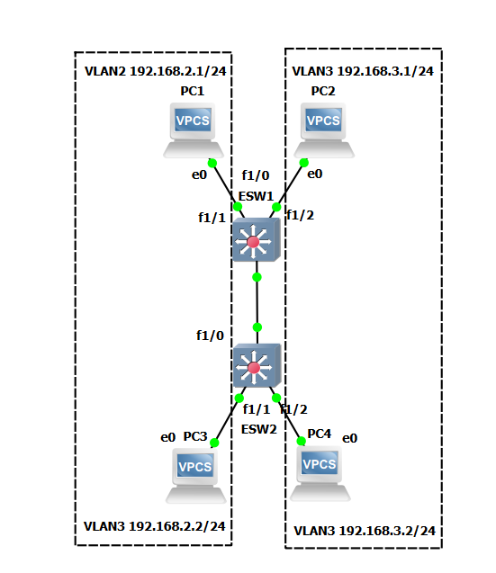
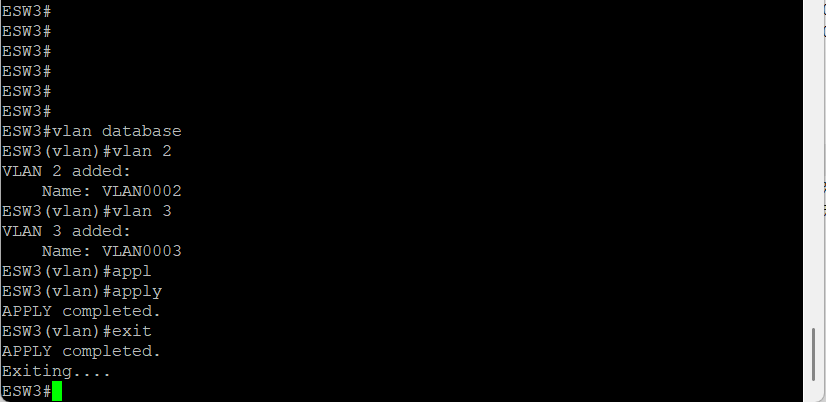
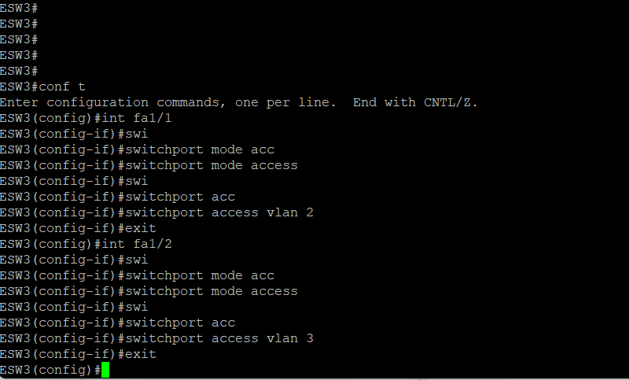
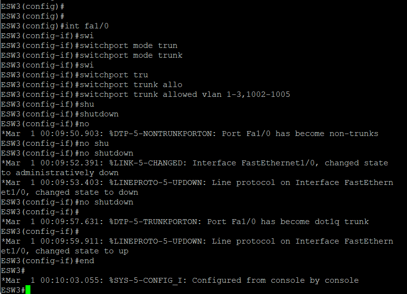
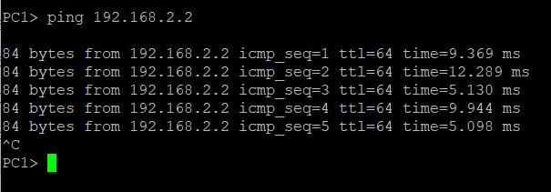
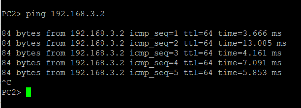
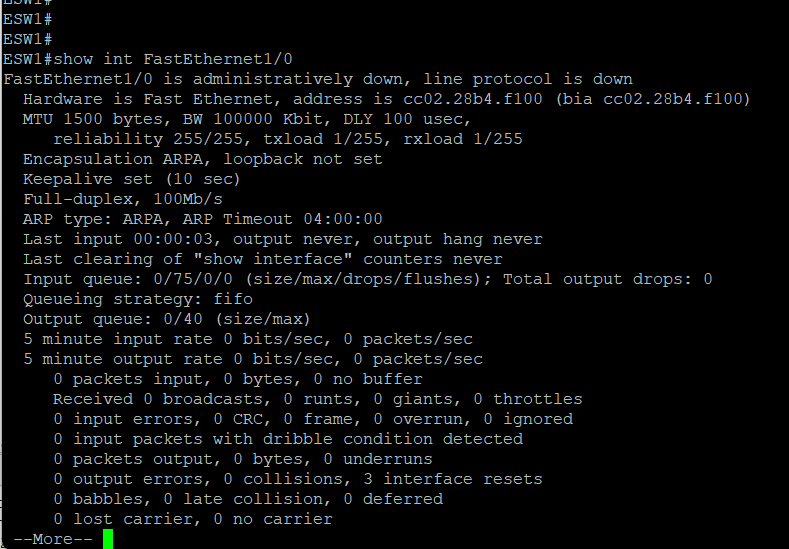

1. Objective of the Work
The objective of this lab is to practice VLAN (Virtual Local Area Network) and Trunking (802.1Q) technologies in a GNS3 emulation environment. This lab requires building a network of two switches and four virtual computers, configuring VLANs for logical network segmentation, and establishing a trunk connection between the switches to transmit traffic from multiple VLANs over a single physical link.

2. Network Topology
For this lab, I used two L3 switches (as GNS3, unlike Cisco Packet Tracer, has significantly limited L2 switch functionality) and four VPCS virtual computers.

Connections:
• 	PC1 → port Fa1/1 on SW1
• 	PC2 → port Fa1/2 on SW1
• 	PC3 → port Fa1/1 on SW2
•	PC4 → port Fa1/2 on SW2
• 	Trunk connection → port Fa1/0 between SW1 and SW2

3. Addressing Plan
PC1 | VLAN 2 | 192.168.2.1 | 255.255.255.0 (/24)
PC2 | VLAN 3 | 192.168.3.1 | 255.255.255.0 (/24)
PC3 | VLAN 2 | 192.168.2.2 | 255.255.255.0 (/24)
PC4 | VLAN 3 | 192.168.3.2 | 255.255.255.0 (/24)

4. Step-by-Step Implementation
4.1. Configuring Switch SW1
Creating a VLAN
To create a VLAN, I used the vlan database command, which allows working with VLANs in VLAN database mode:

 

Configuring Ports in Access Mode
To connect computers, I configured ports in access mode and assigned them to the appropriate VLANs:

Configuring the Trunk Port
I configured port Fa1/0 as a trunk to forward traffic for all VLANs between the switches. It was important to ensure that the port allowed the required VLANs:

4.3. Configuring Switch SW2
Similar settings were made on the second switch.

4.4. Configuring IP Addresses on the VPCS
For each virtual machine, I assigned IP addresses according to the addressing plan:

							PC1:
						PC1> ip 192.168.2.1/24
						PC1> show ip

							PC2:
						PC2> ip 192.168.3.1/24

							PC3:
						PC3> ip 192.168.2.2/24

							PC4:
						PC4> ip 192.168.3.2/24

5. Verifying Functionality
5.1. Checking connectivity within VLANs

PC1 → PC3 (both in VLAN 2):

PC2 → PC4 (both in VLAN 2)

6. Identified issues and solutions
Issue: Trunk port not up
Description: After configuring the trunk port, communication between the switches was not established, and pings between PC1 and PC3 failed.
Troubleshooting: To check the port status, I used the following command:

Analysis: In the command output, I saw that the port was in an administratively down state, as after configuration, it was shut down with the shutdown command and then re-enabled with the no shutdown command. Sometimes, due to emulation issues, additional verification is required.

8. Conclusions
During this lab, I:
1. Built a network in GNS3 using two L3 switches and four VPCS.
2. Configured VLAN 2 and VLAN 3 for logical network segmentation.
3. Configured a trunk connection (802.1Q) between switches to transmit traffic from multiple VLANs over a single link.
4. Tested functionality: devices within the same VLAN successfully exchange data, but not between different VLANs (which corresponds to expected behavior without inter-network routing).
5. Studied the specifics of GNS3: unlike Cisco Packet Tracer, GNS3 required the use of L3 switches to fully support VLANs at the Layer 2 level, which requires an additional understanding of their capabilities and limitations.
6. Learned to diagnose problems with trunk ports using the show interfaces command.
This experience is an important part of my networking and cybersecurity background, as an understanding of VLANs and trunking is essential for designing segmented and secure corporate networks.
